<picture>
  <source media="(prefers-color-scheme: dark)" srcset="assets/hero-dark.svg">
  
</picture>

Three years teaching language models to behave in rooms where being wrong is expensive —
security, compliance, threat intel. In practice that means orchestration you can audit,
retrieval that understands relationships instead of vibes, and a surprising amount of
engineering dedicated to making a model say *I don't know that yet*.

The rest of the time I build small sharp tools for problems that annoy me. Both of the ones
below are local-first, read-only where it counts, and deliberately unexciting about what they
claim.

 

## two of those

<picture>
  <source media="(prefers-color-scheme: dark)" srcset="assets/assay-dark.svg">
  
</picture>

**[github.com/a-dawg010/assay →](https://github.com/a-dawg010/assay)**

<b>how it works</b>

 

Your coding agents write every session to disk in plaintext, at predictable paths, with the
working directory attached to each record. Nobody reads those files, so nobody notices that they
add up to an egress log — a record of what left the machine that the vendors themselves do not
provide. Copilot's admin audit log excludes client-side prompt content; Claude Code and Cursor
make no durable-audit commitment.

The corollary that makes it worth running: **a gateway cannot be installed retroactively.** A
proxy deployed today knows nothing about last quarter. These files do.

It reads Claude Code's JSONL sessions, Codex rollouts, the VS Code and Cursor workspace
databases, and Gemini's shadow git repos, then reports which repository went to which vendor and
when. It is equally clear about what it cannot see: inline completion leaves no local record,
and Antigravity's conversations are encrypted at rest, so they are counted and never decrypted.

Findings are pattern shapes, not verdicts. "Thirteen files contain strings matching a token
pattern" is a true sentence; "thirteen secrets leaked" is not. Matches are redacted to
first-six and last-two characters — enough to deduplicate, not enough to use — and `--share`
prints counts and date ranges only, with the test suite asserting that no repository name or
path escapes. Standard library only. No dependencies, no install, no network.

 

<picture>
  <source media="(prefers-color-scheme: dark)" srcset="assets/shelfmark-dark.svg">
  
</picture>

**[github.com/a-dawg010/shelfmark →](https://github.com/a-dawg010/shelfmark)**

<b>how it works</b>

 

A *shelfmark* is the notation a library puts on an item saying exactly where it lives. Not what
it is about — where it is. That is the whole product: it finds the file and tells you the path.
Not a summary, not a chat.

Type a question and you get two lists, labelled and kept separate. **Matches your words** is a
lexical index — SQLite FTS5, BM25, plus a filename prior that only engages when the query
strongly names a file. **Matches the meaning** is a local embedding index: MiniLM on Accelerate,
384 dimensions, cosine similarity with a floor at 0.45, so nonsense returns nothing instead of
six confident wrong files. The two are shown side by side rather than fused into one list,
because fusing them measured worse than either column alone.

Swift 6, no dependencies, macOS. Everything runs on the machine and nothing is sent anywhere —
the embeddings come from a 22M-parameter model inside the app, not an API. There is a CLI and an
MCP server, so Claude Code and Cursor can search the disk through it too. When neither column
scores well it offers the closest folder rather than a confident wrong answer.

 

---

more, and it moves: **[a-dawg010.github.io](https://a-dawg010.github.io/a-dawg010/)** &nbsp;·&nbsp; no analytics on this page, no newsletter, the crow is load-bearing
